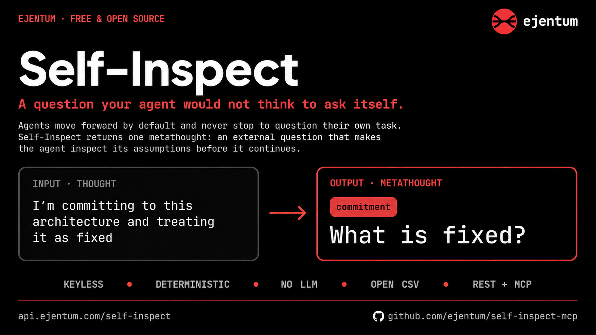

<p align="center">
  
</p>

# Self-Inspect

**A question your agent would not think to ask itself.**

[](https://github.com/ejentum/self-inspect-mcp/actions/workflows/ci.yml)
[](https://www.npmjs.com/package/self-inspect-mcp)
[](https://registry.modelcontextprotocol.io/v0/servers?search=io.github.ejentum/self-inspect-mcp)

An agent sends a thought, or a description of the task it is working on. It gets back one *metathought*: a short, abstract question that turns the agent's attention back onto its own task and assumptions before it continues. Not advice, not an answer. A question.

Keyless, free, deterministic. No LLM, no embeddings, no semantic similarity. Selection is a small heuristic over an open CSV you can read in five minutes, and the code that answers `api.ejentum.com/self-inspect` is the code in this repo. A test proves the two cannot drift.

## Why an agent needs this

Agents move forward. That is the whole problem. Left to itself, an agent:

- commits to its first interpretation and never reopens it,
- piles up assumptions it never names,
- drifts from the original goal over a long chain of steps,
- stops at the first answer that looks plausible,
- grows more confident without growing more evidence,
- agrees with the user because agreeing is the easy path.

None of these are knowledge failures. The model already knows better. They are attention failures: the agent never stops to ask the one question that would have caught it.

And it cannot reliably ask that question itself. Whatever picks what to reflect on is the same process that is already committed, so an agent that "double-checks" tends to re-run its own bias and call it confidence. Acknowledging a trap is not escaping it.

Self-Inspect is the external question. It returns a metathought the agent would not have produced on its own: *What is assumed? What is fixed? What does not follow? What is missing? When would this not hold? What confidence is warranted?* The agent still does the thinking. The tool just makes it look.

## When to call it

Put it in the loop at the moments an agent would otherwise barrel through:

- after forming a hypothesis, before acting on it,
- before committing to a plan or a final answer,
- at each step of a long chain, to catch drift,
- when the agent notices it is agreeing, or feeling certain.

Send a thought, get a metathought, answer it to yourself, continue with more awareness. It always returns a question (there is no "no result" case), one call, no model in the loop, no key.

## How to use the metathought (the recipe)

Self-inspect hands back the one question that names the assumption your claim is quietly resting on. Answer it with a concrete counterexample and rebuild the claim around what breaks; do not just acknowledge the question and move on. Call it only at a genuine wall you cannot get past on your own, never on a schedule: forcing it every step manufactures fake corrections that read worse than using nothing. (This recipe is what separated the strongest runs from the weakest in our own evaluation.)

## Quickstart

Send a `thought`, get a `metathought`. No key.

**REST (any language):**

```sh
curl -s -X POST https://api.ejentum.com/self-inspect \
  -H "Content-Type: application/json" \
  -d '{"thought":"I am committing to this architecture and treating it as fixed"}'
# -> [{ "label": "commitment", "metathought": "What is fixed?" }]
```

**MCP, Claude Code:**

```sh
claude mcp add --transport http self-inspect https://api.ejentum.com/self-inspect-mcp
```

**MCP, Claude Desktop / Cursor / any HTTP-MCP client:**

```json
{
  "mcpServers": {
    "self-inspect": {
      "type": "http",
      "url": "https://api.ejentum.com/self-inspect-mcp"
    }
  }
}
```

The MCP server exposes one tool, `self_inspect`, that takes a `thought` and returns the metathought. No install, no key.

**Python (single file, zero dependencies):**

For Python environments, [`dist/self_inspect.py`](dist/self_inspect.py) is the whole engine in one file — the CSV is inlined, stdlib only, nothing to install. It runs the exact published selector locally (~2 ms per call, no network):

```sh
python self_inspect.py "I am committing to this architecture and treating it as fixed"
# -> [{"label": "commitment", "metathought": "What is fixed?"}]
```

```python
from self_inspect import self_inspect
self_inspect("I am about to assert the default timeout is 30s from memory")
# -> {"label": ..., "metathought": ...}
```

A cross-language parity test (`test/parity.python.test.mjs`) holds it byte-identical to the JS engine — same thought, same metathought, in Python, JS, or against the hosted endpoint.

## Endpoints

| Surface | Endpoint | Auth | Returns |
|---|---|---|---|
| REST | `POST https://api.ejentum.com/self-inspect` | keyless, per-IP rate limit (120/min) | `[{ label, metathought }]` |
| MCP over HTTP | `https://api.ejentum.com/self-inspect-mcp` (Streamable HTTP) | keyless, per-IP rate limit (60/min) | tool `self_inspect` -> metathought text |
| MCP stdio / offline | the `mcp/` package; `SELF_INSPECT_LOCAL=1` runs the selector locally | keyless | tool `self_inspect` (`npx self-inspect-mcp`) |

Both hosted endpoints are keyless and protected by per-IP rate limiting plus standard security headers (HSTS, `nosniff`, frame-deny).

## How selection works

`select(thought, rows)` (`src/selector.js`) routes in two levels, deterministically, over the data in `selfinspect.csv`:

1. Normalize the thought: lowercase, Unicode NFKC, non-alphanumerics to spaces, collapse whitespace, tokenize (`src/normalize.js`).
2. Score each lens (`input_type`): `3 x (type-name tokens present in the thought) + 1 x (distinct content tokens from that lens's questions present)`. Content tokens are the `meta_thought` words minus a small visible stopword list. Evidence aggregates across all of a lens's questions, so a lens can win on signal spread across several of its rows.
3. Pick the highest-scoring lens; ties prefer `strict` over `booster`, then lexicographic lens name.
4. Within the chosen lens, return the question with the most local content matches; tiebreak by lowest `operator_rank` (the canonical question). `matched: true`.
5. If no lens has any signal, return a universal self-inspection question (about task and assumptions) chosen deterministically from a small default set by a stable hash of the input, so different inputs get different nudges. `matched: false`.

**Self-Inspect always returns a metathought.** There is always a worthwhile question an agent can ask about its own task and assumptions, so the tool never returns null. The `matched` flag distinguishes a routed lens (`true`) from a universal default (`false`); the `metathought` is never empty. Deterministic: the same input always returns the same metathought. (To make more inputs route to a specific lens, add wording to the CSV, or a future `triggers` column, never a model.)

## The CSV is the source of truth

`selfinspect.csv` (~50 lenses, 137 questions):

| column | role | shipped to caller |
|---|---|---|
| `input_type` | the cognitive lens; its name tokens are routing keys, weighted x3 | as part of `id` |
| `operator_rank` | order within the lens (1 = canonical); tiebreak | as part of `id` |
| `runtime_tier` | `strict` (core) or `booster` (perceptual); strict preferred on ties | no |
| `meta_thought` | the returned text (verbatim) AND a source of content routing tokens | yes |

The returned `id` is `input_type-operator_rank` (e.g. `confidence-4`). To add or change a metathought, edit the CSV. Do not edit `dist/backend.cjs` or the deployed copy by hand.

## Published == deployed (enforced, not promised)

`npm run build` regenerates `dist/backend.cjs` (the engine behind the hosted endpoint) and `dist/self_inspect.py` (the single-file Python port) from `selfinspect.csv` + `src/normalize.js` + `src/selector.js` (`build/generate.mjs`).

`test/drift.test.mjs` fails if either committed artifact is not byte-identical to the generator output, and `test/parity.python.test.mjs` fails if the Python port's results diverge from the JS selector on the full corpus. So an engine that drifts from the CSV/selector, in either language, cannot pass CI: the full suite runs on every push and pull request (`.github/workflows/ci.yml`), on a runner with Python installed so the parity test actually executes. Anyone can clone this repo, run the fixtures locally and against the live endpoint, and confirm identical selection.

## Verify

```sh
npm test          # selector fixtures + drift test
npm run build     # regenerate dist/backend.cjs
git diff --exit-code dist/backend.cjs   # clean == no drift
```

## Evaluation

What does the metathought actually change? In a 30-turn software-design conversation, agents that called Self-Inspect once per turn surfaced **~3.5x more decision-forks** (assumptions, edge cases, preconditions) than the *identical* agent with no tool: same model (Claude Sonnet 4.6), same conversation, same prompt.

And the question is *aimed*, not generic: the routing tracked the moment. `When would this not hold?` arrived as the agent was making a boundary call; `What is assumed?` arrived as it was about to persist state, and it answered *"I've been assuming persistence lives outside the module"* — surfacing an assumption it had never stated.

The full data, the verbatim metathoughts, and a one-command reproduction (`node evals/tools/analyze.mjs`) are in [`evals/`](evals/).

## Response contract

REST returns an array of one object with exactly two fields: `label` (the lens, from `input_type`) and `metathought` (the question). Unroutable input still returns a universal default (a different lens, same shape):

```
{"thought":"How much confidence is warranted in this result?"} -> [{ "label": "confidence", "metathought": "What confidence is warranted?" }]
{"thought":"order a pizza"}                                     -> [{ "label": "sequence",   "metathought": "What order is active?" }]
```

The MCP surfaces (`self_inspect`) return the `metathought` text only.

## Deploying the engine (operator)

The hosted side runs `dist/backend.cjs` (the CommonJS build of the same CSV + selector) inside an Express route, mounted keyless and isolated from any auth/tier. `dist/backend.cjs` is regenerated by `npm run build` and is drift-tested against the source. To update: edit `selfinspect.csv`, run `npm run build`, redeploy the build. Never edit the deployed copy by hand.

## MCP

`mcp/` is a standalone MCP server (`self-inspect-mcp`) exposing one tool, `self_inspect`. By default it calls the hosted endpoint; set `SELF_INSPECT_LOCAL=1` to run this exact selector offline against a vendored copy of the CSV. See `mcp/README.md`.

## Troubleshooting

**`CRYPT_E_NO_REVOCATION_CHECK` or a TLS revocation error on connect.** The certificate is valid (Let's Encrypt, full chain, `verify ok`). TLS uses Let's Encrypt, which is CRL-based now: OCSP was retired by the CA in 2026, so there is no OCSP responder to query. Strict clients that hard-fail revocation when OCSP is unavailable (some Windows/schannel setups) can report this even though the cert is fine. Most clients (Node, Python TLS) soft-fail and connect normally. If yours hard-fails, set revocation checking to soft-fail; the certificate is valid.

## License

MIT.
